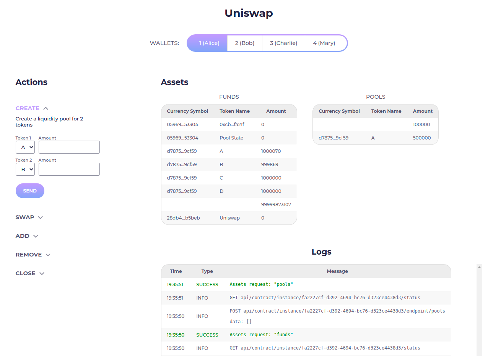

# Uniswap Playground

Uniswap playground is another example of using Uniswap contract and pab-api-js lib. It has a simple interface for calling endpoints and switching between wallets. 



## Code

[https://github.com/fullstack-development/pab-api-js/tree/main/examples/uniswap-playground](https://github.com/fullstack-development/pab-api-js/tree/main/examples/uniswap-playground)

## Installation

```bash
❯ git clone https://github.com/fullstack-development/pab-api-js.git

❯ cd pab-api-js/examples/uniswap-playground

❯ npm install
```

## Run

To test the playground, you first need to run PAB from lesson 10 of plutus-pioneer-program ([link](https://github.com/input-output-hk/plutus-pioneer-program)) or plutus-pab from plutus repo ([link](https://github.com/input-output-hk/plutus-apps/tree/main/plutus-pab), tag: `71a0805f`), command `cabal run plutus-uniswap`.

```bash
❯ npm run dev
```